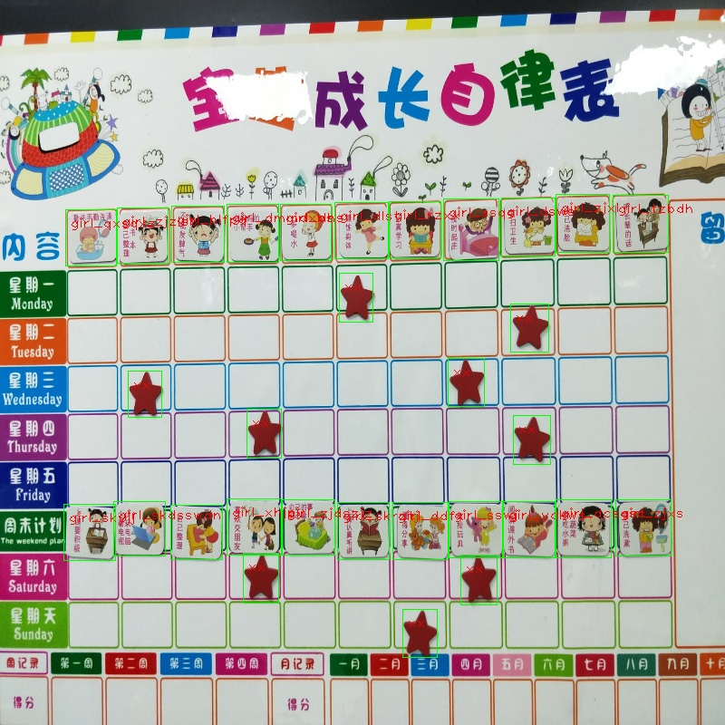

# cartoon
卡通画识别项目
# model
* 第一套模型文件：链接: https://pan.baidu.com/s/1wWnPQQBBUYO7iWjzqupARw
* 第二套模型文件：链接: https://pan.baidu.com/s/12y1PvkfdDWztzx2IgM6SGQ
* 将模型文件放入项目跟路径下的model文件夹下
# run
* 进入项目目录
* mkdir build
* cmake ..
* make
* ./cartoon
* 程序会识别目录imgs下的test.jpg
# result
* 
